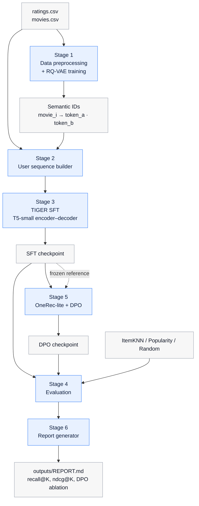

# Tiger-DPO-RecSys

[](https://colab.research.google.com/github/MasterpieceXu/Tiger-dpo-recsys/blob/main/notebooks/colab_train.ipynb)
[](https://www.python.org/downloads/release/python-3110/)
[](https://pytorch.org/)
[](LICENSE)

A generative recommender system for MovieLens-32M built on the **TIGER**
recipe (Rajput et al., NeurIPS 2023) and aligned with **Direct Preference
Optimization** (Rafailov et al., NeurIPS 2023).

每部电影通过 RQ-VAE 被编码为短码 (semantic ID)；T5-small 在用户历史上
做监督微调，学会自回归地生成下一个 semantic ID；最后通过 DPO 进一步
对齐用户的真实偏好。整个流水线还包含三个传统 baseline (ItemKNN /
Popularity / Random) 与自动报告生成。

> Built on top of [xkx-youcha/GR-movie-recommendation](https://github.com/xkx-youcha/GR-movie-recommendation).
> See [`CHANGELOG.md`](CHANGELOG.md) for the list of modifications.

---

## Features

- **End-to-end pipeline** from raw `ratings.csv` to a Markdown comparison
  report, organised into 6 self-contained stages.
- **Generative retrieval** with semantic IDs (RQ-VAE) and a T5-small
  encoder–decoder backbone.
- **Preference alignment** via DPO with a frozen reference model and full
  per-sample sequence log-probabilities (no batch-loss approximation).
- **Memory-efficient baselines**: ItemKNN uses a sparse user–item matrix
  with top-N nearest neighbours, keeping the similarity store at
  ~30 MB on the full dataset (versus ~30 GB for the dense version).
- **Configuration presets** for laptop CPU smoke tests, free-tier Colab,
  and Colab Pro full runs.
- **Reproducible**: pinned dependencies, Colab notebook with pre-flight
  checks, and automatic Drive backups.

---

## Architecture



The repository ships a single entry point (`scripts/run_pipeline.py`)
that drives the six stages, and each stage can also be invoked
independently for debugging.

---

## Quickstart

### Colab (recommended)

1. Click the badge at the top of this README.
2. `Runtime → Change runtime type → T4 GPU` (free) or `A100 / V100`
   (Colab Pro).
3. `Runtime → Run all`.

The first cell selects a preset and prints a pre-flight summary (GPU,
free RAM/VRAM, disk space). All artefacts are mirrored to
`Drive/MyDrive/tiger-dpo-recsys-runs/<preset>-<timestamp>/` so a runtime
disconnect does not lose progress.

### Local (CPU smoke test only)

For environments without a GPU, the `local_smoke` preset runs the entire
pipeline on a 5 000-user subset in under 30 minutes. The resulting
metrics are not meaningful — this preset exists only to validate that
the codebase runs end-to-end on a given machine.

```bash
git clone https://github.com/MasterpieceXu/Tiger-dpo-recsys.git
cd Tiger-dpo-recsys

python -m venv .venv
source .venv/bin/activate           # Windows: .\.venv\Scripts\Activate.ps1
pip install -r requirements.txt

mkdir -p dataset && cd dataset
curl -LO https://files.grouplens.org/datasets/movielens/ml-32m.zip
unzip ml-32m.zip && cd ..

python scripts/run_pipeline.py --preset local_smoke
```

GPU training is intended to run on Colab; no local CUDA setup
instructions are provided.

---

## Stages

Each stage writes to a fixed location and can be re-run independently.

| Stage | Command flag         | Output                                  |
| :---: | -------------------- | --------------------------------------- |
|   0   | `--stages 0`         | environment & dataset checks            |
|   1   | `--stages 1`         | RQ-VAE checkpoint, semantic-ID mapping  |
|   2   | `--stages 2`         | tokenised user sequences                |
|   3   | `--stages 3`         | TIGER SFT checkpoint                    |
|   4   | `--stages 4`         | `outputs/evaluation_results.json`       |
|   5   | `--stages 5`         | DPO checkpoint, `outputs/dpo_metrics.json` |
|   6   | `--stages 6`         | `outputs/REPORT.md`                     |

Stages may be combined. For example, after editing the evaluator and
wanting a fresh report:

```bash
python scripts/run_pipeline.py --stages 4,6 --preset free_colab_safe
```

---

## Configuration

Hyper-parameters are centralised in `config.py`. Three presets are
provided through `apply_preset` and can be selected via the `--preset`
CLI flag or the `GR_PRESET` environment variable.

| Preset             | Users | TIGER epochs | TIGER batch (×accum) | DPO epochs | Test users | Wall-clock              |
| ------------------ | :---: | :----------: | :------------------: | :--------: | :--------: | ----------------------- |
| `local_smoke`      |   5k  |       1      |       8 (×1)         |     1      |    500     | < 30 min, CPU friendly  |
| `free_colab_safe`  | 150k  |       3      |      16 (×2)         |     2      |   5 000    | ~3–4 h on Colab T4      |
| `pro_colab_full`   |  all  |       5      |      24 (×2)         |     3      |  10 000    | ~8–10 h on Colab Pro    |

A separate `default` preset preserves the upstream paper-style settings
(full dataset, no user cap, batch size 32) and is used when no preset is
specified.

---

## Outputs

After a complete run, the following artefacts are produced:

| Path                                | Contents                                                    |
| ----------------------------------- | ----------------------------------------------------------- |
| `models/rqvae_final.pt`             | trained RQ-VAE                                              |
| `models/tiger_final/`               | TIGER (SFT only) checkpoint and tokenizer                   |
| `models/onerec_lite_dpo/`           | TIGER (SFT + DPO) checkpoint                                |
| `outputs/evaluation_results.json`   | raw per-model recall@K and ndcg@K                           |
| `outputs/dpo_metrics.json`          | per-epoch DPO loss, reward margin and accuracy              |
| `outputs/REPORT.md`                 | Markdown comparison report (the user-facing output)         |

The report contains:

1. A headline summarising the best model and its primary metric.
2. A full comparison table over all configured `recall@K` and `ndcg@K`.
3. The DPO ablation row (SFT vs SFT + DPO) with per-metric deltas.
4. The DPO training dynamics (loss / reward margin / accuracy per epoch).

---

## Implementation notes

### DPO objective

For a preference pair `(prompt, chosen, rejected)`, let
$\pi_\theta$ denote the policy model and $\pi_{\text{ref}}$ a frozen
copy of the SFT model. With sequence log-probabilities

$$
\log\pi(y \mid x) = \sum_{t} \log p(y_t \mid y_{\lt t}, x),
$$

the loss optimised in `src/dpo.py` is

$$
\mathcal{L}_{\text{DPO}} = -\mathbb{E}\bigl[\log\sigma\bigl(
\beta\,(\log\pi_\theta(y_w \mid x) - \log\pi_{\text{ref}}(y_w \mid x))
- \beta\,(\log\pi_\theta(y_l \mid x) - \log\pi_{\text{ref}}(y_l \mid x))
\bigr)\bigr],
$$

with $\beta = 0.1$ by default. Padding tokens are masked using `-100`
labels so they do not contribute to the per-sample log-probability sum.
Only the policy path retains gradients; the reference path runs under
`torch.no_grad()`.

Per-batch diagnostics (`reward_chosen`, `reward_rejected`,
`reward_margin`, `accuracy = P(margin > 0)`) are logged to
`outputs/dpo_metrics.json` for the report generator to render.

### ItemKNN at scale

The dense item × item cosine-similarity matrix used by traditional
ItemKNN scales as `O(I²)` and exceeds 30 GB on MovieLens-32M
(≈ 87 000 items). The implementation in `src/evaluation.py` instead
builds a sparse `csr_matrix` of user–item interactions and uses
`sklearn.neighbors.NearestNeighbors` to retrieve the top-N nearest
neighbours per item, reducing the storage to `O(I × N)` ≈ 30 MB at
`N = 50`.

---

## Project structure

```
Tiger-dpo-recsys/
├── README.md
├── CHANGELOG.md
├── LICENSE
├── config.py                    # all hyper-parameters and presets
├── requirements.txt             # pinned versions
├── utils.py                     # shared data and metric utilities
├── src/
│   ├── data_preprocessing.py    # ratings filtering and text features
│   ├── rqvae.py                 # residual-quantised VAE
│   ├── train_rqvae.py           # Stage 1
│   ├── sequence_generator.py    # Stage 2
│   ├── tiger_model.py           # T5 wrapper and tokenizer extension
│   ├── train_tiger.py           # Stage 3
│   ├── dpo.py                   # DPO loss, log-probability, trainer
│   ├── onerec_lite.py           # Stage 5 (preference-pair construction)
│   ├── evaluation.py            # Stage 4 (TIGER variants + baselines)
│   └── report.py                # Stage 6 (Markdown rendering)
├── scripts/
│   └── run_pipeline.py          # single entry point for all stages
├── notebooks/
│   └── colab_train.ipynb        # Colab one-click training notebook
├── dataset/ml-32m/              # data (gitignored)
├── models/                      # checkpoints (gitignored)
├── outputs/                     # JSON results + REPORT.md
└── logs/
```

---

## Requirements

- **Python 3.11**. Versions ≤ 3.10 lack typing features used in the code,
  and 3.13 has no official `sentencepiece` wheel at the time of writing.
- **PyTorch 2.5**. The pipeline auto-detects CUDA and disables `fp16`
  on CPU-only environments.
- **Transformers ≥ 4.41, < 4.46**. Newer versions have removed the
  `evaluation_strategy` keyword argument used by the trainer.
- The first run downloads `t5-small` (~250 MB) from the Hugging Face Hub.

A complete dependency list with version ranges is in
[`requirements.txt`](requirements.txt).

---

## References

- Rajput, S. *et al.* "Recommender Systems with Generative Retrieval."
  *NeurIPS*, 2023. [arXiv:2305.05065](https://arxiv.org/abs/2305.05065)
- Rafailov, R. *et al.* "Direct Preference Optimization: Your Language
  Model is Secretly a Reward Model." *NeurIPS*, 2023.
  [arXiv:2305.18290](https://arxiv.org/abs/2305.18290)
- Harper, F. M. & Konstan, J. A. "The MovieLens Datasets: History and
  Context." *ACM TiiS*, 2015.
  [GroupLens, MovieLens-32M](https://grouplens.org/datasets/movielens/32m/)

## Acknowledgements

The pipeline structure and the Stage 1 / Stage 2 implementations are
adapted from
[xkx-youcha/GR-movie-recommendation](https://github.com/xkx-youcha/GR-movie-recommendation).
The MovieLens-32M dataset is provided by GroupLens Research at the
University of Minnesota.

## License

Released under the MIT License. See [`LICENSE`](LICENSE) for details.
